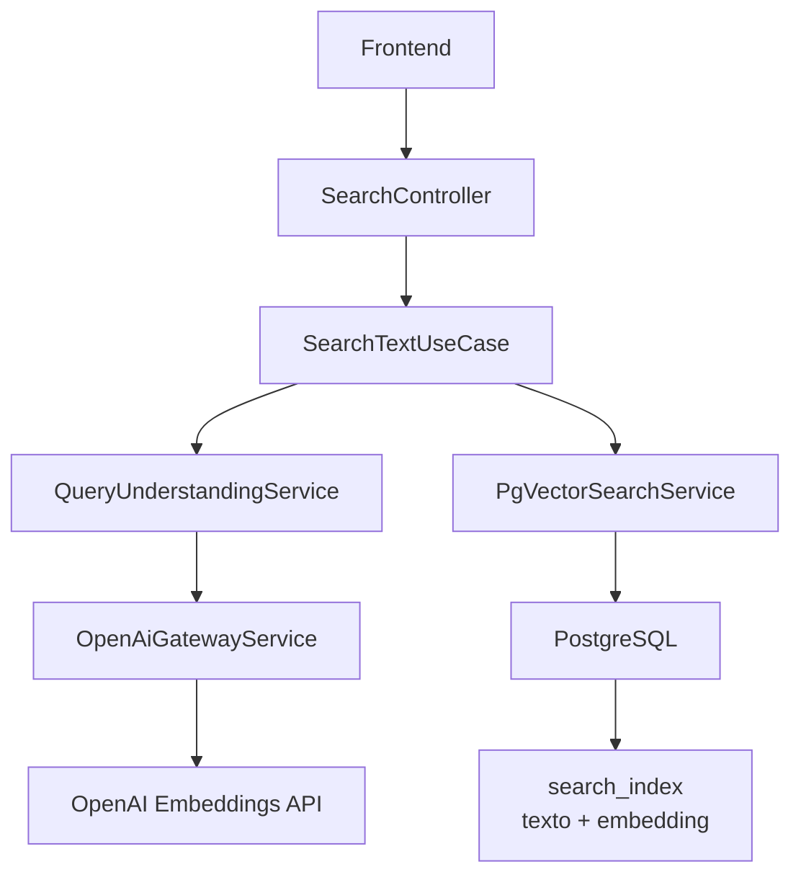
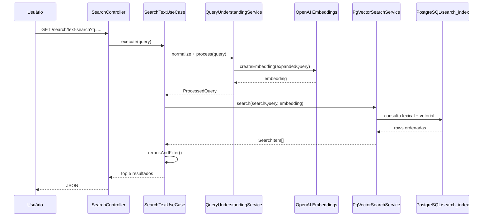
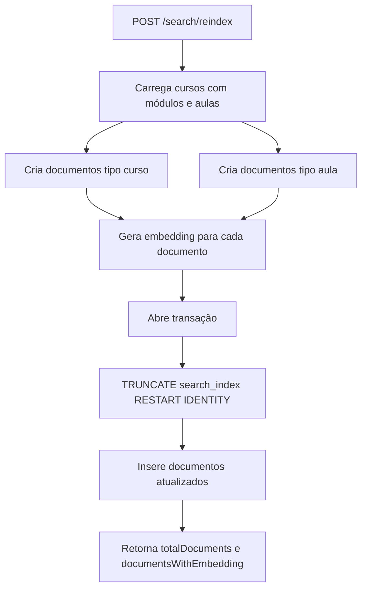
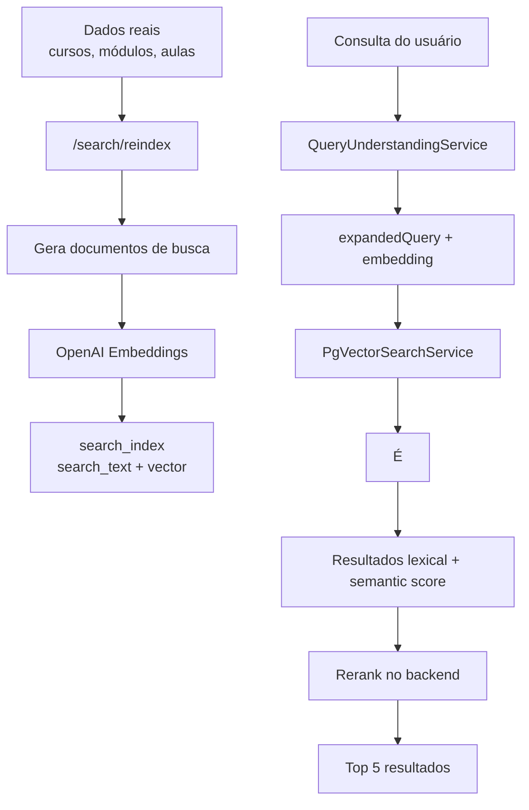

# Busca Semântica - Documentação Técnica

## Objetivo da feature

A busca semântica da SoftSolutions permite pesquisar cursos e aulas combinando duas estratégias:

- **busca lexical**, baseada em texto, usando recursos nativos do PostgreSQL;
- **busca vetorial**, baseada em embeddings, usando a extensão `pgvector`.

Com isso, a aplicação consegue retornar resultados relevantes mesmo quando o usuário não usa exatamente os mesmos termos cadastrados nos cursos ou aulas.

Exemplo:

```text
Entrada do usuário:
"quero criar aplicativo para celular"

Resultado possível:
"Aplicativos Móveis com React Native"
```

## Visão geral da arquitetura



## Principais arquivos envolvidos

```text
src/interfaces/http/controllers/search.controller.ts
src/application/use-cases/search/search-text.use-case.ts
src/application/use-cases/search/search-voice.use-case.ts
src/infrastructure/search/nlp/query-understanding.service.ts
src/infrastructure/search/nlp/semantic-knowledge.dictionary.ts
src/infrastructure/search/pgvector/pgvector-search.service.ts
src/infrastructure/shared/openai-gateway.service.ts
src/infrastructure/database/migrations/1770000000000-CreateSearchIndex.ts
```

## Endpoints

### Busca textual

```http
GET /search/text-search?q=java
```

Responsável por executar o fluxo principal de busca.

Retorno conceitual:

```json
{
  "results": [],
  "total": 0,
  "query": "java"
}
```

### Autocomplete

```http
GET /search/autocomplete?q=jav
```

Consulta a tabela `search_index` e retorna sugestões de títulos.

### Busca por voz

```http
POST /search/voice
```

Recebe um texto já transcrito da fala do usuário e aplica o mesmo mecanismo da busca textual.

### Reindexação

```http
POST /search/reindex
```

Recria o conteúdo da tabela `search_index` com base nos cursos, módulos e aulas atuais.

## Fluxo da busca textual



## Entendimento da consulta

Antes de consultar o banco, o texto passa pelo `QueryUnderstandingService`.

Esse serviço gera uma estrutura interna chamada conceitualmente de `ProcessedQuery`.

Ela contém:

```text
originalText
normalizedText
intent
confidence
embedding
tokens
filteredTokens
matchedTerms
synonyms
concepts
boostTerms
exclusions
categories
expandedQuery
```

### Normalizacao

O texto é normalizado para:

- letras minusculas;
- remoção de acentos;
- remoção de pontuação;
- reducao de espacos duplicados.

Exemplo:

```text
"Quero aprender Back-End com Java!"
```

vira:

```text
"quero aprender back end com java"
```

### Stopwords

Algumas palavras pouco relevantes são removidas ou ignoradas no entendimento.

Exemplos:

```text
quero
gostaria
buscar
mostrar
me
pra
sobre
de
do
da
```

### Dicionário semantico

O arquivo `semantic-knowledge.dictionary.ts` adiciona sinônimos, conceitos, termos de reforço e exclusões.

Exemplos:

```text
backend -> api, servidor, rest, node, nestjs
frontend -> ui, interface, web, react, javascript
java -> spring, spring boot
sql -> postgresql, mysql, banco de dados
docker -> container, compose, devops
```

Isso permite que uma busca por "backend" também considere termos como "api" e "servidor".

### Ambiguidade

O dicionário também evita algumas confusoes:

```text
java != javascript
javascript != java
sql != nosql
react != reactive
```

Essas exclusões ajudam no filtro final dos resultados.

## Geração de embeddings

Os embeddings são gerados pelo `OpenAiGatewayService`.

Endpoint externo chamado:

```text
https://api.openai.com/v1/embeddings
```

Modelo padrão:

```text
text-embedding-3-small
```

Variavel que pode alterar o modelo:

```text
OPENAI_EMBEDDING_MODEL
```

Se `OPENAI_API_KEY` não estiver configurada, o backend não gera embedding e a busca pode cair para uma estratégia lexical.

## Tabela search_index

A tabela `search_index` é um índice materializado de busca.

Ela é derivada das tabelas principais:

```text
cursos
modulos
aulas
```

Ela armazena documentos pesquisáveis de dois tipos:

```text
curso
aula
```

Campos principais:

```text
document_id
tipo
curso_id
aula_id
titulo
descricao
descricao_detalhada
categoria
conteudo
professor
status
avaliacao
imagem_curso
tempo_curso
modulo
curso
video_url
tempo_aula
search_text
embedding
created_at
updated_at
```

## Migration da search_index

A estrutura é criada pela migration:

```text
1770000000000-CreateSearchIndex.ts
```

Ela executa:

```sql
CREATE EXTENSION IF NOT EXISTS vector;
```

Depois cria a tabela com:

```sql
embedding vector(1536)
```

E cria índices como:

```sql
idx_search_index_tipo
idx_search_index_curso_id
idx_search_index_search_text
idx_search_index_embedding
```

## Papel do pgvector

O tipo `vector` não existe no PostgreSQL puro.

Ele é fornecido pela extensão:

```text
pgvector
```

No Azure Database for PostgreSQL, essa extensão precisa estar liberada no parâmetro `azure.extensions`.

Sem isso, a migration falha com erro semelhante a:

```text
extension "vector" is not allow-listed
```

## Reindexação

O endpoint `/search/reindex` executa o método `reindexCursosEAulas()`.

Fluxo:



Para cada curso, são usados campos como:

```text
nomeCurso
descricaoCurta
descricaoDetalhada
categoria
professor
```

Para cada aula, são usados campos como:

```text
nomeAula
descricaoConteudo
nomeModulo
nomeCurso
categoria
professor
```

## Consulta no PostgreSQL

O `PgVectorSearchService` usa duas consultas principais.

### Quando existe embedding

A busca usa:

```sql
1 - (embedding <=> $1::vector)
```

Esse cálculo gera o `semantic_score`.

Também calcula o `lexical_score` com:

```sql
ts_rank_cd(to_tsvector('portuguese', search_text), plainto_tsquery('portuguese', $2))
```

Ordenação:

```sql
ORDER BY semantic_score DESC, lexical_score DESC, updated_at DESC
```

### Quando não existe embedding

A busca usa apenas estratégia lexical:

```sql
to_tsvector('portuguese', search_text) @@ plainto_tsquery('portuguese', $1)
OR search_text ILIKE $2
```

Ordenação:

```sql
ORDER BY lexical_score DESC, updated_at DESC
```

## Rerank no backend

Depois da consulta no banco, o `SearchTextUseCase` aplica um rerank.

Ele aumenta a pontuação quando:

- o item é do tipo `curso`;
- o item é do tipo `aula`;
- o texto contém termos relevantes;
- a categoria combina com a busca.

Ele penaliza quando:

- o resultado contém termos excluídos;
- a busca é de backend e o resultado é claramente frontend;
- a busca é de frontend e o resultado é claramente backend.

O retorno final é limitado aos 5 melhores resultados.

## Modelo de resultado

O resultado é mapeado para `SearchItem`.

Campos principais:

```text
id
tipo
cursoId
aulaId
titulo
descricao
descricaoDetalhada
categoria
conteudo
professor
modulo
curso
videoUrl
tempoAula
url
semanticScore
```

A URL é montada assim:

```text
tipo curso -> /curso/{curso_id}
tipo aula  -> /curso/{curso_id}/aulas
```

## Dependencias de ambiente

```text
DATABASE_URL
OPENAI_API_KEY
OPENAI_EMBEDDING_MODEL
```

Dependencia no banco:

```text
Extensão vector liberada
Tabela search_index criada
Tabela search_index preenchida
```

## Quando executar reindex

Execute `/search/reindex` quando:

- um curso for criado;
- um curso for editado;
- uma aula for criada;
- uma aula for editada;
- o banco for restaurado;
- a tabela `search_index` for recriada;
- os embeddings precisarem ser regenerados.

## Falhas comuns

### relation "search_index" does not exist

Causa:

```text
A tabela search_index não existe no banco atual.
```

Correcao:

```powershell
npm.cmd run migration:run
```

Depois:

```powershell
Invoke-RestMethod `
  -Method Post `
  -Uri "https://softsolutions-api-prod-brs-fycdfxh4b2g7evgn.canadacentral-01.azurewebsites.net/search/reindex" `
  -TimeoutSec 300
```

### extension "vector" is not allow-listed

Causa:

```text
O Azure PostgreSQL ainda não permite a extensão pgvector.
```

Correcao:

```text
Azure Portal -> PostgreSQL -> Server parameters -> azure.extensions -> liberar vector
```

Depois rode novamente:

```powershell
npm.cmd run migration:run
```

### Busca não encontra curso novo

Causa provavel:

```text
O curso existe nas tabelas principais, mas a search_index ainda não foi atualizada.
```

Correcao:

```http
POST /search/reindex
```

## Resumo técnico



Resumo:

```text
A busca semântica materializa cursos e aulas na tabela search_index, gera embeddings com OpenAI, armazena vetores com pgvector e combina ranking lexical, ranking vetorial e rerank de negócio para retornar resultados relevantes.
```
