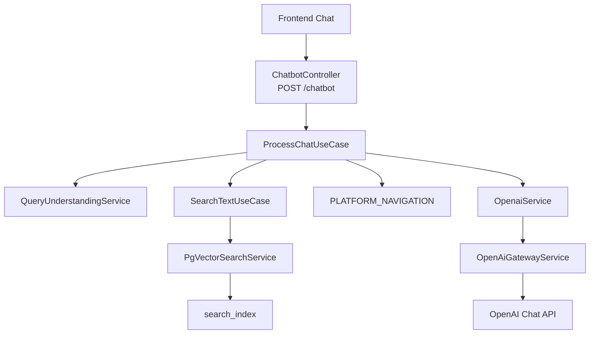
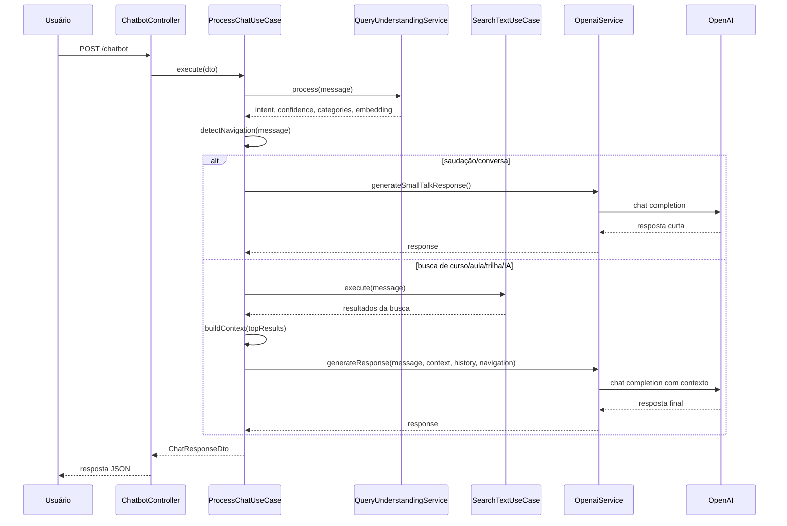
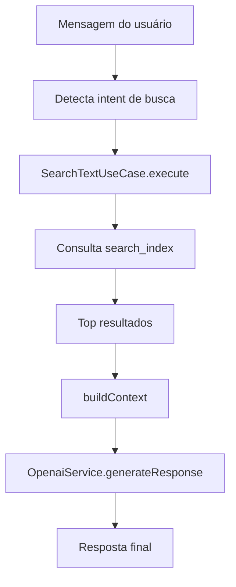
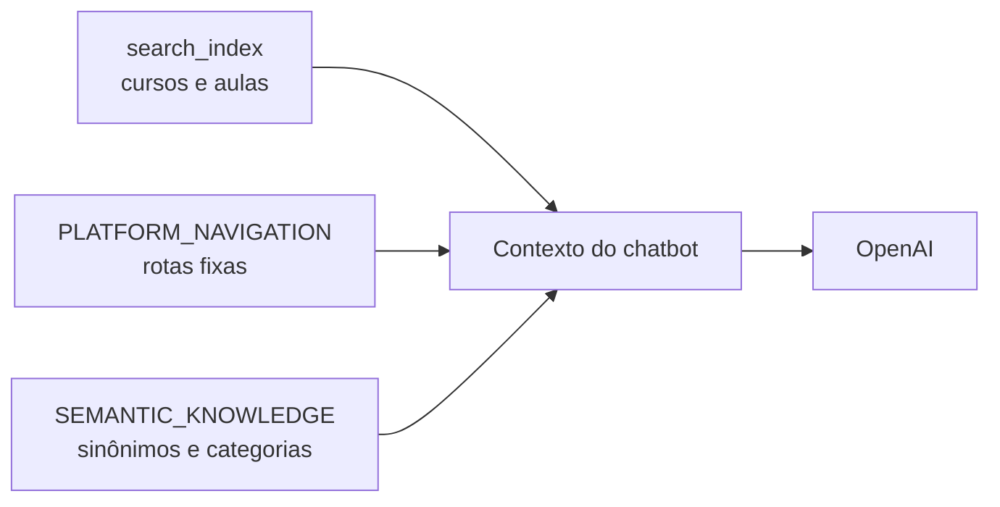
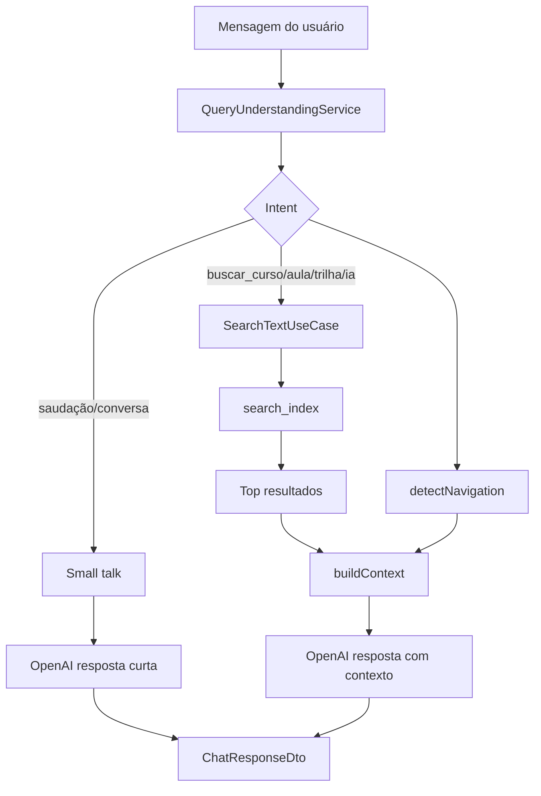

# Chatbot - Documentação Técnica

## Objetivo da feature

O chatbot da SoftSolutions fornece uma interface conversacional para:

- responder saudações e conversas simples;
- ajudar o usuário a encontrar cursos e aulas;
- orientar navegação dentro da plataforma;
- montar respostas naturais com base em contexto real da aplicação.

O chatbot não armazena todo o conhecimento dentro do modelo de IA. Ele usa contexto recuperado pelo backend e depois chama a OpenAI para gerar a resposta final.

## Visão geral da arquitetura



## Principais arquivos envolvidos

```text
src/interfaces/http/controllers/chatbot.controller.ts
src/application/use-cases/chatbot/process-chat.use-case.ts
src/infrastructure/chatbot/openai/openai.service.ts
src/infrastructure/chatbot/navigation/platform-navigation.dictionary.ts
src/application/use-cases/search/search-text.use-case.ts
src/infrastructure/search/nlp/query-understanding.service.ts
src/infrastructure/search/pgvector/pgvector-search.service.ts
src/infrastructure/shared/openai-gateway.service.ts
```

## Endpoint

```http
POST /chatbot
```

O endpoint recebe uma mensagem e opcionalmente o histórico da conversa.

Payload conceitual:

```json
{
  "message": "quero aprender backend",
  "history": [
    { "role": "user", "content": "oi" },
    { "role": "assistant", "content": "Olá! Como posso ajudar?" }
  ]
}
```

Resposta conceitual:

```json
{
  "response": "texto da resposta",
  "intent": "buscar_curso",
  "confidence": 0.75,
  "suggestions": [],
  "requiresHumanSupport": false,
  "relatedCourses": [],
  "navigation": [],
  "semanticContext": {
    "intent": "buscar_curso",
    "categories": [],
    "concepts": []
  }
}
```

## Fluxo principal



## ProcessChatUseCase

O `ProcessChatUseCase` é o orquestrador do chatbot.

Responsabilidades:

- processar a mensagem do usuário;
- identificar intenção;
- detectar contexto de navegação;
- decidir se deve ou não consultar a busca semântica;
- montar contexto para a OpenAI;
- gerar sugestões relacionadas;
- retornar a resposta padronizada para o frontend.

## Entendimento da mensagem

A mensagem passa pelo `QueryUnderstandingService`.

Esse serviço retorna informações como:

```text
intent
confidence
categories
concepts
matchedTerms
expandedQuery
embedding
```

Exemplo:

```text
Mensagem:
"tem curso de backend com java?"

Intent:
buscar_curso

Categorias:
backend

Conceitos:
backend java
```

## Intenções suportadas

O chatbot trata intenções como:

```text
saudação
agradecimento
despedida
conversa
buscar_curso
buscar_aula
buscar_trilha
buscar_ia
certificado
login
desconhecida
```

As intenções de conversa simples seguem um fluxo diferente das intenções de busca.

## Fluxo de conversa simples

Quando a intenção é:

```text
saudação
agradecimento
despedida
conversa
```

o chatbot não consulta a `search_index`.

Ele chama:

```text
OpenaiService.generateSmallTalkResponse()
```

Esse método envia para a OpenAI:

- prompt de sistema simples;
- últimas mensagens do histórico;
- mensagem atual do usuário.

Configuração usada:

```text
temperature: 0.7
maxTokens: 120
```

## Fluxo de busca com contexto

Quando a intenção esta nesta lista:

```text
buscar_curso
buscar_aula
buscar_trilha
buscar_ia
```

o chatbot consulta a busca semântica.



O backend pega no máximo os 5 melhores resultados.

Filtro aplicado:

```text
item.semanticScore undefined ou item.semanticScore > 0
```

## Fontes de contexto

O chatbot usa tres fontes principais de contexto.



### 1. search_index

Fonte dos dados sobre cursos e aulas.

Preenchida por:

```http
POST /search/reindex
```

Usada quando o usuário quer encontrar conteúdo da plataforma.

### 2. PLATFORM_NAVIGATION

Arquivo:

```text
platform-navigation.dictionary.ts
```

Contém rotas fixas da plataforma.

Exemplos:

```text
login -> /login
cadastro -> /cadastro
certificados -> /certificados
contato -> /contato
cursos -> /cursos-lista
recuperar senha -> /recuperar-senha
```

Essa fonte é usada mesmo sem buscar cursos.

### 3. SEMANTIC_KNOWLEDGE

Arquivo:

```text
semantic-knowledge.dictionary.ts
```

Ajuda o backend a entender termos relacionados.

Exemplos:

```text
backend -> api, servidor, rest, node, nestjs
frontend -> interface, web, react, javascript
java -> spring, spring boot
sql -> postgresql, mysql, banco de dados
```

## Deteccao de navegação

O método `detectNavigation()` compara a mensagem normalizada com as palavras-chave cadastradas em `PLATFORM_NAVIGATION`.

Pontuação:

```text
match exato: +100
mensagem contém keyword: +25
palavra isolada igual keyword: +40
```

Se o melhor score for pelo menos `40`, a navegação é considerada encontrada.

Resultado conceitual:

```json
{
  "label": "Login",
  "route": "/login",
  "description": "Entre na sua conta da plataforma."
}
```

## Montagem do contexto para OpenAI

Quando existem resultados de busca, o backend monta um texto com:

```text
Título
Descrição
Categoria
Tipo
Curso
Professor
```

Exemplo:

```text
# Resultado 1
Título: Aplicativos Móveis com React Native
Descrição: Desenvolva apps para iOS e Android com React Native.
Categoria: Mobile
Tipo: curso
Curso: Aplicativos Móveis com React Native
Professor: Ana Paula
```

Se não houver resultados:

```text
Nenhum conteúdo relevante encontrado na plataforma.
```

## Prompt enviado para a OpenAI

O `OpenaiService.generateResponse()` usa um prompt de sistema com regras como:

```text
- responder em português do Brasil;
- usar somente o contexto fornecido para recomendar cursos;
- não inventar cursos, tecnologias, trilhas ou funcionalidades;
- ajudar o usuário a navegar pela plataforma quando houver contexto de navegação;
- ser objetivo, natural e amigável.
```

Configuração usada:

```text
temperature: 0.45
maxTokens: 450
```

Histórico:

```text
últimas 10 mensagens da conversa
```

## Resposta para casos de IA sem curso

Existe uma regra específica para `buscar_ia`.

Se a intenção for `buscar_ia` e não houver resultados relevantes, o backend retorna uma mensagem fixa dizendo que a SoftSolutions ainda não possui cursos específicos de Inteligência Artificial ou Machine Learning.

Esse retorno evita que a IA invente cursos de IA que não existem na plataforma.

## requiresHumanSupport

O campo `requiresHumanSupport` é calculado assim:

```text
processed.confidence < 0.15 && !topResults.length
```

Ou seja, se a confiança for muito baixa e não houver resultados, o backend sinaliza que pode ser necessário suporte humano.

## Sugestões e cursos relacionados

O método `generateSuggestions()` cria uma lista com nomes de cursos ou títulos encontrados.

Regra:

```text
results.map(item => item.curso || item.titulo)
```

Depois remove duplicados e limita a 5 sugestões.

Essas sugestões são retornadas em:

```text
suggestions
relatedCourses
```

## Como a OpenAI participa

A OpenAI participa em dois pontos:

### Embeddings

Usada indiretamente pela busca semântica, via `OpenAiGatewayService.createEmbedding()`.

Modelo padrão:

```text
text-embedding-3-small
```

### Resposta conversacional

Usada via `OpenaiService.generateResponse()` ou `generateSmallTalkResponse()`.

Modelo padrão:

```text
gpt-4.1-mini
```

## Limites do chatbot

O chatbot é limitado principalmente por:

- contexto recuperado na `search_index`;
- rotas cadastradas em `PLATFORM_NAVIGATION`;
- termos cadastrados em `SEMANTIC_KNOWLEDGE`;
- instrucoes do prompt de sistema;
- disponibilidade da OpenAI.

Ele não acessa automaticamente todo o banco e não navega pelo código em tempo real.

Se um curso novo for cadastrado, o chatbot so passa a encontra-lo corretamente apos:

```http
POST /search/reindex
```

## Perguntas fora do escopo

Perguntas fora da plataforma podem cair em `desconhecida` ou não gerar resultados.

Hoje, a contenção é feita por:

- classificacao de intenção;
- ausencia de contexto relevante;
- prompt dizendo para não inventar;
- resposta com suporte humano quando a confiança é baixa.

Observação técnica:

```text
Essa barreira não é absoluta, pois depende também do comportamento do modelo.
Para bloqueio rigido, seria necessário retornar resposta fixa antes de chamar a OpenAI.
```

## Dependencias de ambiente

```text
DATABASE_URL
OPENAI_API_KEY
OPENAI_CHAT_MODEL
OPENAI_EMBEDDING_MODEL
JWT_SECRET
```

## Falhas comuns

### secretOrPrivateKey must have a value

Causa:

```text
JWT_SECRET ausente.
```

Impacto:

```text
Login e fluxos autenticados podem falhar.
```

### relation "search_index" does not exist

Causa:

```text
Tabela search_index ausente.
```

Impacto:

```text
Chatbot falha ao tentar buscar cursos/aulas.
```

Correcao:

```powershell
npm.cmd run migration:run
```

Depois:

```powershell
Invoke-RestMethod `
  -Method Post `
  -Uri "https://softsolutions-api-prod-brs-fycdfxh4b2g7evgn.canadacentral-01.azurewebsites.net/search/reindex" `
  -TimeoutSec 300
```

### Chatbot não encontra curso cadastrado

Causa provavel:

```text
search_index desatualizada.
```

Correcao:

```http
POST /search/reindex
```

### OpenAI indisponivel ou chave ausente

Impacto:

```text
Sem embeddings é/ou sem resposta conversacional gerada pela IA.
```

O código trata falhas da OpenAI retornando `undefined` nos serviços de gateway, mas a experiência final pode ser degradada.

## Resumo técnico



Resumo:

```text
O chatbot orquestra entendimento de linguagem, busca semântica, rotas fixas da plataforma e OpenAI para responder com base em contexto real, evitando depender apenas do conhecimento genérico do modelo.
```
