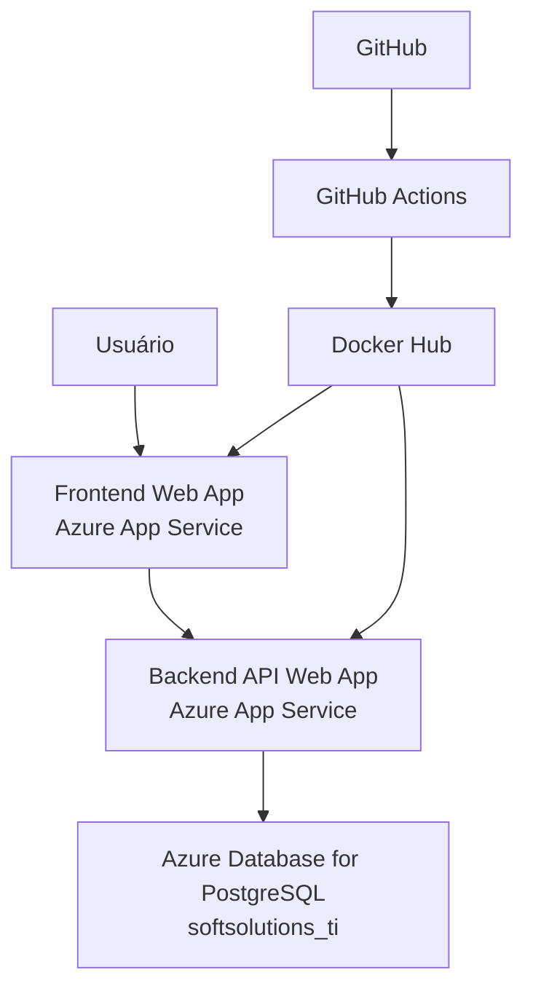
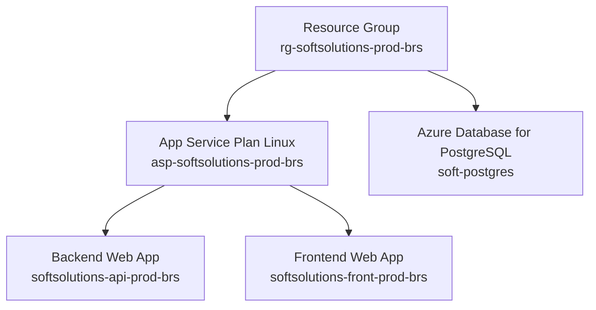
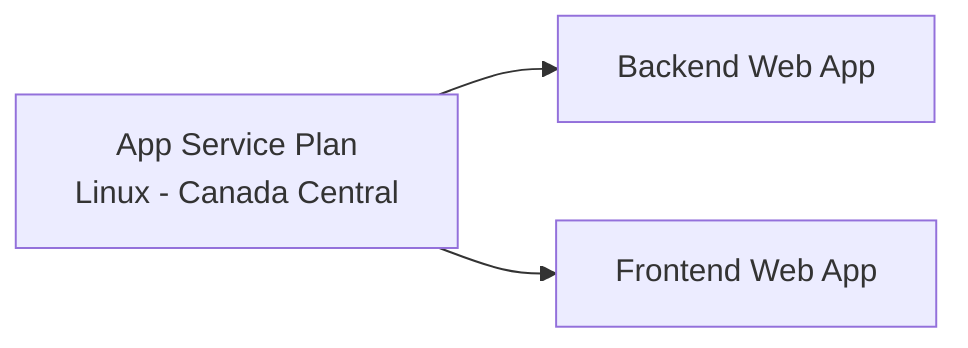
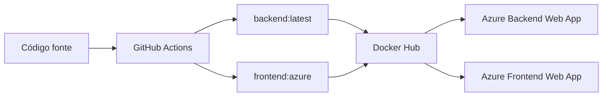
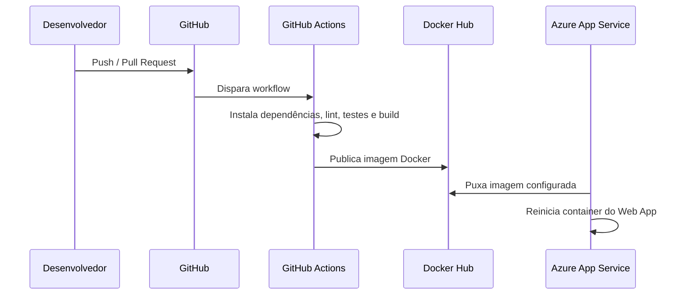
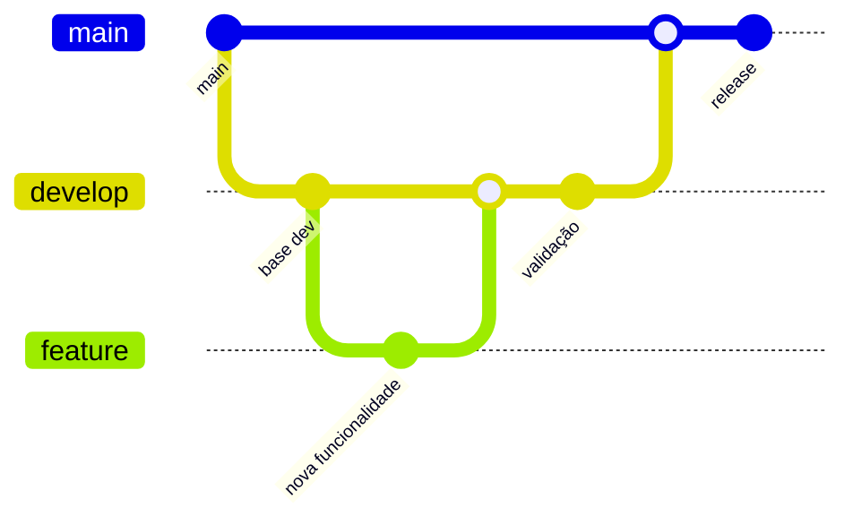
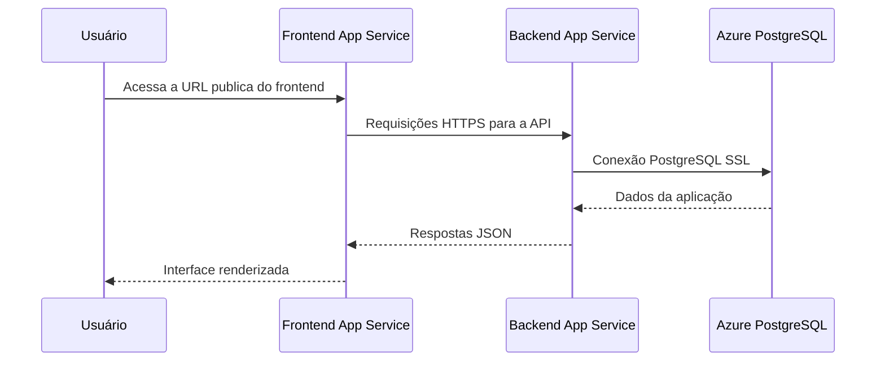
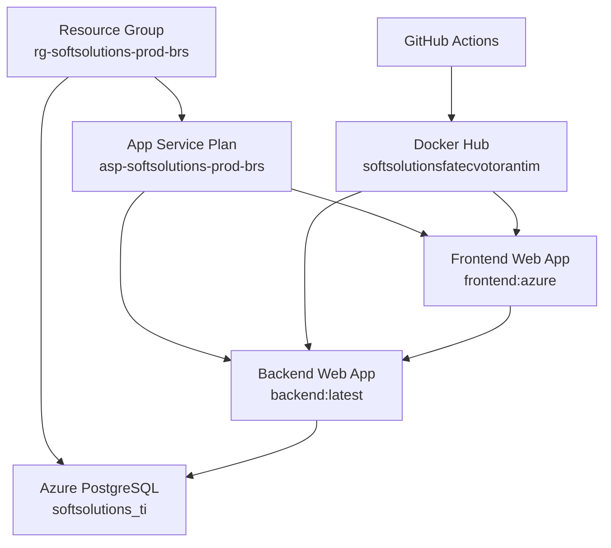

# Infraestrutura em Nuvem Azure - SoftSolutions

## Objetivo

Este documento descreve a infraestrutura em nuvem utilizada para hospedar a plataforma SoftSolutions na Azure.

O foco desta documentação é a organização dos recursos de nuvem, a relação entre eles e o fluxo de publicação da aplicação. Detalhes internos de código, regras de negócio, busca semântica e chatbot ficam em documentações específicas.

## Visão geral da arquitetura

A aplicação está publicada na Azure usando uma arquitetura simples baseada em containers.

Componentes principais:

- Resource Group;
- App Service Plan Linux;
- Web App do frontend;
- Web App do backend;
- Azure Database for PostgreSQL;
- Docker Hub como registry das imagens;
- GitHub Actions como pipeline de build/publicação.



## Organização dos recursos Azure

Os recursos da solução ficam agrupados em um Resource Group.



## Resource Group

Nome:

```text
rg-softsolutions-prod-brs
```

Função:

```text
Agrupar e organizar os recursos Azure da solução SoftSolutions.
```

Região do Resource Group:

```text
Brazil South
```

Observação:

```text
Embora o Resource Group esteja em Brazil South, os App Services foram provisionados em Canada Central por disponibilidade/restrição no momento da criação.
```

## App Service Plan

Nome:

```text
asp-softsolutions-prod-brs
```

Tipo:

```text
Linux
```

Região efetiva:

```text
Canada Central
```

Função:

```text
Fornecer a camada de computação para os Web Apps da aplicação.
```

O App Service Plan é compartilhado pelo frontend e pelo backend.



## Web App do Backend

Nome:

```text
softsolutions-api-prod-brs
```

Serviço:

```text
Azure App Service
```

Sistema operacional:

```text
Linux
```

Modelo de publicação:

```text
Docker Container
```

Imagem:

```text
softsolutionsfatecvotorantim/backend:latest
```

Porta exposta pela aplicação:

```text
4000
```

Variavel necessária para o Azure direcionar trafego ao container:

```text
WEBSITES_PORT=4000
```

URL publica:

```text
https://softsolutions-api-prod-brs-fycdfxh4b2g7evgn.canadacentral-01.azurewebsites.net
```

## Web App do Frontend

Nome:

```text
softsolutions-front-prod-brs
```

Serviço:

```text
Azure App Service
```

Sistema operacional:

```text
Linux
```

Modelo de publicação:

```text
Docker Container
```

Imagem:

```text
softsolutionsfatecvotorantim/frontend:azure
```

Porta:

```text
80
```

URL publica:

```text
https://softsolutions-front-prod-brs-ewgbctepdgggewde.canadacentral-01.azurewebsites.net
```

## Banco de dados

Serviço:

```text
Azure Database for PostgreSQL
```

Host:

```text
soft-postgres.postgres.database.azure.com
```

Porta:

```text
5432
```

Database da aplicação:

```text
softsolutions_ti
```

Usuário:

```text
admsoft
```

Conexão usada pelo backend:

```text
DATABASE_URL
```

Formato:

```text
postgresql://admsoft:<senha-url-encoded>@soft-postgres.postgres.database.azure.com:5432/softsolutions_ti?sslmode=require
```

Observações:

- o database correto da aplicação é `softsolutions_ti`;
- o database `postgres` não deve ser usado pela aplicação;
- a conexão utiliza SSL com `sslmode=require`;
- a extensão `vector` foi liberada para suporte a recursos que dependem de pgvector.

## Registry de imagens

As imagens Docker são publicadas no Docker Hub.

Organização:

```text
softsolutionsfatecvotorantim
```

Imagens usadas pela infraestrutura Azure:

```text
softsolutionsfatecvotorantim/backend:latest
softsolutionsfatecvotorantim/frontend:azure
```



## Pipeline de publicação

A esteira de publicação usa GitHub Actions e Docker Hub.

Fluxo geral:



## Fluxo de branches

Fluxo de versionamento adotado:



Descrição:

- novas funcionalidades são desenvolvidas em branches `feature`;
- depois são integradas na `develop`;
- a `develop` é usada para validação;
- a `main` representa a versão estável;
- na `main`, os workflows podem gerar build e publicar imagens Docker.

## Comunicação entre os recursos

Fluxo de runtime:



## CORS

Como frontend e backend possuem URLs diferentes, o backend precisa liberar a origem do frontend.

Origem do frontend Azure:

```text
https://softsolutions-front-prod-brs-ewgbctepdgggewde.canadacentral-01.azurewebsites.net
```

Sem CORS correto:

```text
Backend pode responder normalmente em testes diretos,
mas o navegador bloqueia a resposta para o frontend.
```

Com CORS correto:

```text
Frontend consegue consumir a API publicada na Azure.
```

## Variáveis de ambiente operacionais

Variáveis principais no backend:

```text
WEBSITES_PORT
NODE_ENV
DATABASE_URL
JWT_SECRET
EMAIL_SUPPORT_USER
EMAIL_SUPPORT_PASS
EMAIL_SUPPORT_DESTINATION
OPENAI_API_KEY
OPENAI_EMBEDDING_MODEL
OPENAI_CHAT_MODEL
```

Variáveis relacionadas a CORS:

```text
CORS_ORIGINS
FRONTEND_ORIGINS
```

Variáveis principais do frontend:

```text
BUILD_CONFIG=azure
```

Observação:

```text
Segredos devem ser armazenados nas configurações do App Service, nunca no repositório.
```

## Segurança da infraestrutura

Principais medidas:

- uso de HTTPS nas URLs publicas;
- segredos configurados como variáveis de ambiente;
- conexão PostgreSQL com SSL;
- CORS restrito a origens conhecidas;
- JWT configurado por `JWT_SECRET`;
- imagens Docker separadas para backend e frontend.

## Monitoramento e logs

O acompanhamento operacional é feito principalmente pelos logs do Azure App Service.

Esses logs permitem verificar:

- inicializacao dos containers;
- erros de aplicação;
- chamadas HTTP recebidas;
- status das respostas;
- tempo de execução das requisições;
- falhas de configuração;
- problemas de conexão com banco;
- erros de CORS ou autenticação.

Exemplo de informações registradas pelo backend:

```text
method
path
statusCode
durationMs
requestId
```

## Endpoints oficiais

Frontend:

```text
https://softsolutions-front-prod-brs-ewgbctepdgggewde.canadacentral-01.azurewebsites.net
```

Backend:

```text
https://softsolutions-api-prod-brs-fycdfxh4b2g7evgn.canadacentral-01.azurewebsites.net
```

Swagger da API:

```text
https://softsolutions-api-prod-brs-fycdfxh4b2g7evgn.canadacentral-01.azurewebsites.net/api
```

## Domínio

Atualmente a aplicação usa os dominios padrão gerados pelo Azure App Service.

Exemplo:

```text
*.azurewebsites.net
```

Para uma URL mais profissional, pode ser configurado um domínio próprio, como:

```text
https://app.softsolutions.com.br
```

Ao adicionar um domínio próprio ao frontend, a nova origem também deve ser liberada no CORS do backend.

## Estado geral da infraestrutura

A infraestrutura Azure possui:

- frontend publicado em App Service;
- backend publicado em App Service;
- banco PostgreSQL gerenciado no Azure;
- imagens Docker publicadas no Docker Hub;
- pipeline de build/publicação via GitHub Actions;
- comunicação frontend/backend por HTTPS;
- comunicação backend/banco via PostgreSQL com SSL;
- logs disponíveis pelo Azure App Service.

## Resumo

